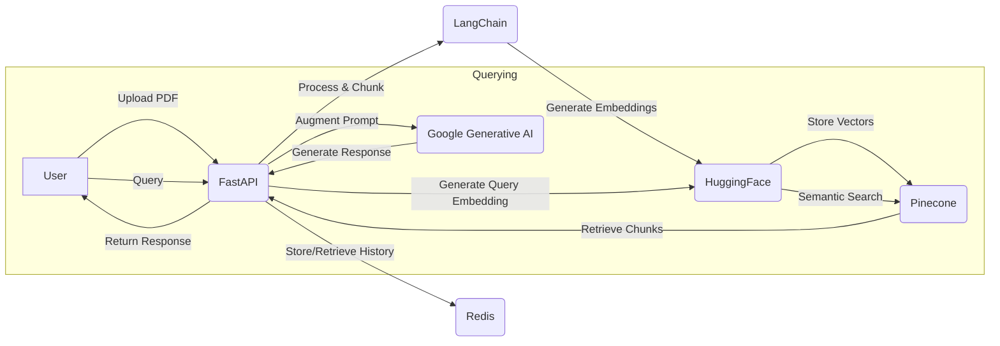

# RAG FastAPI Project

This project is a **Retrieval-Augmented Generation (RAG) API** built with FastAPI. It leverages LangChain, Pinecone, Redis, and Google's Generative AI to create a conversational AI that can answer questions based on uploaded documents.

## Features

-   **Document Upload:** Upload PDF files to be processed and stored.
-   **Text Processing:** Documents are chunked into smaller pieces for efficient embedding and retrieval.
-   **Vector Embeddings:** Uses HuggingFace sentence transformers to generate embeddings for text chunks.
-   **Vector Storage:** Stores and indexes vectors in a Pinecone vector database for fast semantic search.
-   **Conversational AI:** Utilizes Google's Generative AI (Gemini) to generate answers based on retrieved context.
-   **Conversation History:** Maintains conversation history for each user using Redis, allowing for follow-up questions and context-aware responses.
-   **FastAPI Backend:** A robust and fast asynchronous API built with FastAPI.

## Architecture

The application follows a simple RAG architecture:



## Technologies Used

-   **Backend:** FastAPI, Uvicorn
-   **AI/ML:**
    -   LangChain
    -   Google Generative AI (Gemini)
    -   HuggingFace Sentence Transformers
    -   Pinecone (Vector Database)
-   **Data Storage:**
    -   Redis (Conversation History)
-   **File Processing:**
    -   PyMuPDF
    -   PDFminer
-   **Tooling:**
    -   `uv` for package management
    -   `python-dotenv` for environment variables
    -   `pydantic` for settings management

## Getting Started

### Prerequisites

-   Python 3.11+
-   `uv` (or `pip`)
-   A Pinecone account and API key
-   A Google AI API key
-   Redis server running

### Installation

1.  **Clone the repository:**

    ```bash
    git clone https://github.com/your-username/FastAPI_rag_and_appointment.git
    cd FastAPI_rag_and_appointment
    ```

2.  **Install dependencies:**

    ```bash
    uv pip install -r requirements.txt
    ```

3.  **Set up environment variables:**

    Create a `.env` file in the root directory and add the following:

    ```env
    PINECONE_API_KEY="YOUR_PINECONE_API_KEY"
    PINECONE_HOST="YOUR_PINECONE_HOST"
    GOOGLE_API_KEY="YOUR_GOOGLE_API_KEY"
    REDIS_HOST="localhost"
    REDIS_PORT="6379"
    ```

### Running the Application

```bash
    uvicorn src.practise.main:app --reload
    ```

 The API will be available at `http://127.0.0.1:8000`.

## API Endpoints

### File Upload

-   **POST** `/upload_file`

    Upload one or more PDF files.

    **Example (`curl`):**

    ```bash
    curl -X POST "http://127.0.0.1:8000/upload_file" \
         -H "accept: application/json" \
         -H "Content-Type: multipart/form-data" \
         -F "file=@/path/to/your/file1.pdf" \
         -F "file=@/path/to/your/file2.pdf"
    ```

### Query

-   **POST** `/query`

    Ask a question. The `sender_id` is used to maintain conversation history.

    **Parameters:**

    -   `query`: The question to ask.
    -   `sender_id`: A unique identifier for the user/session.

    **Example (`curl`):**

    ```bash
    curl -X POST "http://127.0.0.1:8000/query?query=What%20is%20the%20main%20topic%20of%20the%20document%3F&sender_id=user123" \
         -H "accept: application/json"
    ```

## Project Structure

```
├── .gitignore
├── .python-version
├── pyproject.toml
├── README.md
├── uv.lock
└── src
    └── practise
        ├── __init__.py
        ├── agent
        │   └── _agent.py       # Core agent logic
        ├── config.py           # Pydantic settings
        ├── data                # Sample PDF files
        ├── llm
        │   ├── gemini_llm.py   # Google Generative AI setup
        │   └── splitter.py     # Text splitter configuration
        ├── routes
        │   └── file_routes.py  # API endpoints
        ├── services
        │   └── file_upload.py  # File upload service logic
        └── store
            ├── pinecone.py     # Pinecone service
            ├── query.py        # Query handling logic
            └── redis.py        # Redis connection
```

## Contributing

Contributions are welcome! Please feel free to submit a pull request.

1.  Fork the repository.
2.  Create a new branch (`git checkout -b feature/your-feature`).
3.  Make your changes.
4.  Commit your changes (`git commit -m 'Add some feature'`).
5.  Push to the branch (`git push origin feature/your-feature`).
6.  Open a pull request.

## License

This project is licensed under the MIT License. See the [LICENSE](LICENSE) file for details.